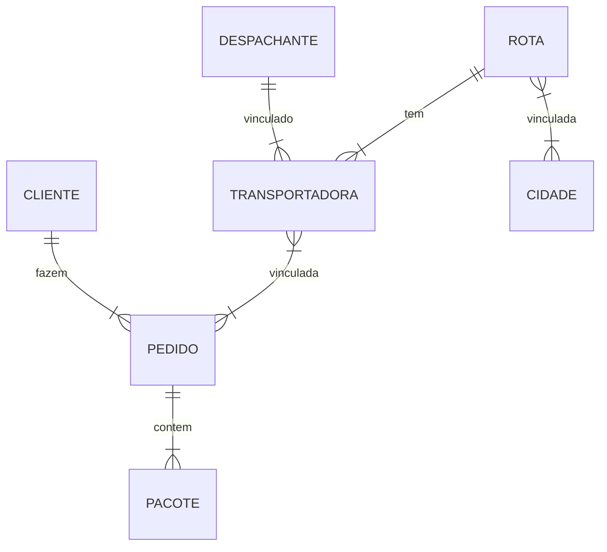
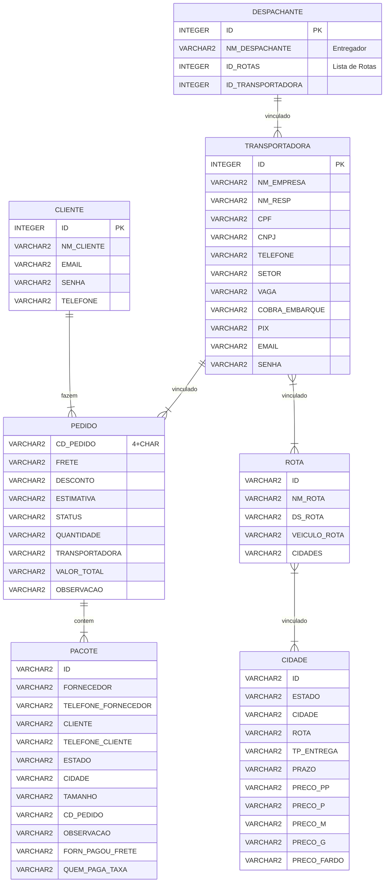

# Entrega-Mais-Web-Rails

> Repositório contendo Backend em Ruby on Rails

## Pré-Defesa dos Projetos

---

- Apresentação da Equipe (máximo 2 integrantes)
	- Diego Figueiredo de Medeiros
	- Alissia Deolinda Oliveira de Lima
- Uma breve descrição do sistema
	- Escopo do problema
		> Há um sério problema com a organização e padronização das entregas de pacotes, principalmente no escopo das grandes feiras (como as de Santa Cruz, Caruaru), tanto em polos urbanos quanto grandes capitais. Logo, há a necessidade de uma solução que consiga organizar, informar e facilitar o processo de entregas.
	- Objetivo 
		> Desenvolver uma aplicação mobile escalável  a fim de servir como mediador entre as entregas, previamente informais, feitas através de excursões, facilitando o processo de entregas como um todo, com a opção de organizar e informar todo o andamento das mercadorias, para que, através da criação, edição, exclusão e acompanhamento de pedidos, rotas, clientes, despachantes, pacotes, veículos e transportadoras, haja uma mitigação no grave problema com a organização e padronização das entregas de pacotes, principalmente no escopo das grandes feiras.
- Requisitos funcionais
	> O sistema deverá permitir, de maneira rápida e eficiente, o gerenciamento de entregas através de cadastros e relatórios. Deverá auxiliar a organização informações do pacote, transportadora, rotas, clientes, veiculos e pedido durante excursões em grandes feiras, permitindo que os transportadores e fornecedores possam administrar e fazer análises e estudos em cima destes dados coletados, além de poder gerar uma série de relatórios, pacotes, pedidos, clientes, rotas históricos) e gráficos (valores de frete, compra e pedidos).

- Requisitos não funcionais:
	- React / React Native
	- Ruby on Rails
	- Cloud
		- AWS
	- Fila de Mensagens
		- RabbitMQ
	- Cache
		- REDIS
	- REST
	- RPC/RMI

- O modelo relacional do BD


---
# Diagramas ER
## Conceitual
---

## Lógico
---

<style>
	/* 
	fill		| Background color of an entity or attribute
	stroke		| Border color of an entity or attribute, line color of a relationship 
	!importante	| Needed to change default attributes
	*/
/* Box */
.er.attributeBoxEven { /*The box containing attributes on even-numbered rows*/
	fill: #525252 !important; 
}
.er.attributeBoxOdd { /*The box containing attributes on odd-numbered rows*/
	fill: #383838 !important;
}

/* Entity */
.er.entityBox { /*The box representing an entity*/
	stroke-width: 2px !important;
}
.er.entityLabel { /*The label for an entity*/
}

/* Relationship */
.er.relationshipLabel { /*The label for a relationship*/
}
.er.relationshipLabelBox { /*The box surrounding a relationship label*/
}
.er.relationshipLine { /*The line representing a relationship between entities*/
}
</style>




## Pré-requisitos
---

É necessário a instalação dos seguintes recursos:

- [Docker](https://docs.docker.com/get-docker/) e [WSL 2](https://docs.microsoft.com/en-us/windows/wsl/install)

## Iniciando via Docker
Na raiz do projeto, onde há o arquivo `docker-compose.yml`, execute o seguinte comando:
```
docker compose build
```

Em seguida, suba o container com o seguinte comando:
```
docker compose up -d
```

Crie a database com o seguinte comando:
```
docker compose exec web rake db:create
```

Crie as tabelas na database com o seguinte comando:
```
docker compose exec web rails db:migrate
```

## Usando
```
docker compose build
```

Em seguida, suba o container com o seguinte comando:
```
docker compose up -d
```

--- 
Agora basta enviar requisições com o método **`POST`** para a porta **`3000`**:
```
http://localhost:3000/<model>
```
Com o corpo da requisição contendo um JSON neste formato:
```
{
	<atributo1>: <dado1>,
	<atributo2>: <dado2>,
	...
}
```

[⬆ Voltar ao topo](#Entrega-Mais-Web-Rails)

# Quickstart: Compose and Rails

This Quickstart guide shows you how to use Docker Compose to set up and run
a Rails/PostgreSQL app. Before starting, [install Compose](https://docs.docker.com/compose/install/).

## Define the project

Start by setting up the files needed to build the app. The app will run inside a
Docker container containing its dependencies. Defining dependencies is done using
a file called `Dockerfile`. To begin with, the  Dockerfile consists of:

```dockerfile
# syntax=docker/dockerfile:1
FROM ruby:2.5
RUN apt-get update -qq && apt-get install -y nodejs postgresql-client
WORKDIR /myapp
COPY Gemfile /myapp/Gemfile
COPY Gemfile.lock /myapp/Gemfile.lock
RUN bundle install

# Add a script to be executed every time the container starts.
COPY entrypoint.sh /usr/bin/
RUN chmod +x /usr/bin/entrypoint.sh
ENTRYPOINT ["entrypoint.sh"]
EXPOSE 3000

# Configure the main process to run when running the image
CMD ["rails", "server", "-b", "0.0.0.0"]
```

That'll put your application code inside an image that builds a container
with Ruby, Bundler and all your dependencies inside it. For more information on
how to write Dockerfiles, see the [Docker user guide](https://docs.docker.com/get-started/)
and the [Dockerfile reference](https://docs.docker.com/engine/reference/builder/).

Next, open an editor and create a bootstrap `Gemfile` which just loads Rails. This will be overwritten in a moment by `rails new`.

```ruby
source 'https://rubygems.org'
gem 'rails', '~>5'
```

Create an empty `Gemfile.lock` file to build our `Dockerfile`.

```console
$ touch Gemfile.lock
```

Next, provide an entrypoint script to fix a Rails-specific issue that
prevents the server from restarting when a certain `server.pid` file pre-exists.
This script will be executed every time the container gets started.
`entrypoint.sh` consists of:

```bash
#!/bin/bash
set -e

# Remove a potentially pre-existing server.pid for Rails.
rm -f /myapp/tmp/pids/server.pid

# Then exec the container's main process (what's set as CMD in the Dockerfile).
exec "$@"
```

Finally, `docker-compose.yml` is where the magic happens. This file describes
the services that comprise your app (a database and a web app), how to get each
one's Docker image (the database just runs on a pre-made PostgreSQL image, and
the web app is built from the current directory), and the configuration needed
to link them together and expose the web app's port.

```yaml
services:
  db:
    image: postgres
    volumes:
      - ./tmp/db:/var/lib/postgresql/data
    environment:
      POSTGRES_PASSWORD: password
  web:
    build: .
    command: bash -c "rm -f tmp/pids/server.pid && bundle exec rails s -p 3000 -b '0.0.0.0'"
    volumes:
      - .:/myapp
    ports:
      - "3000:3000"
    depends_on:
      - db
```

> **Tip**
>
> You can use either a `.yml` or `.yaml` extension for this file.

### Build the project

With those files in place, you can now generate the Rails skeleton app
using [docker compose run](https://docs.docker.com/engine/reference/commandline/compose_run/):

```console
$ docker compose run --no-deps web rails new . --force --database=postgresql
```

First, Compose builds the image for the `web` service using the `Dockerfile`.
The `--no-deps` tells Compose not to start linked services. Then it runs
`rails new` inside a new container, using that image. Once it's done, you
should have generated a fresh app.

List the files.

```console
$ ls -l

total 64
-rw-r--r--   1 vmb  staff   222 Jun  7 12:05 Dockerfile
-rw-r--r--   1 vmb  staff  1738 Jun  7 12:09 Gemfile
-rw-r--r--   1 vmb  staff  4297 Jun  7 12:09 Gemfile.lock
-rw-r--r--   1 vmb  staff   374 Jun  7 12:09 README.md
-rw-r--r--   1 vmb  staff   227 Jun  7 12:09 Rakefile
drwxr-xr-x  10 vmb  staff   340 Jun  7 12:09 app
drwxr-xr-x   8 vmb  staff   272 Jun  7 12:09 bin
drwxr-xr-x  14 vmb  staff   476 Jun  7 12:09 config
-rw-r--r--   1 vmb  staff   130 Jun  7 12:09 config.ru
drwxr-xr-x   3 vmb  staff   102 Jun  7 12:09 db
-rw-r--r--   1 vmb  staff   211 Jun  7 12:06 docker-compose.yml
-rw-r--r--   1 vmb  staff   184 Jun  7 12:08 entrypoint.sh
drwxr-xr-x   4 vmb  staff   136 Jun  7 12:09 lib
drwxr-xr-x   3 vmb  staff   102 Jun  7 12:09 log
-rw-r--r--   1 vmb  staff    63 Jun  7 12:09 package.json
drwxr-xr-x   9 vmb  staff   306 Jun  7 12:09 public
drwxr-xr-x   9 vmb  staff   306 Jun  7 12:09 test
drwxr-xr-x   4 vmb  staff   136 Jun  7 12:09 tmp
drwxr-xr-x   3 vmb  staff   102 Jun  7 12:09 vendor
```

If you are running Docker on Linux, the files `rails new` created are owned by
root. This happens because the container runs as the root user. If this is the
case, change the ownership of the new files.

```console
$ sudo chown -R $USER:$USER .
```

If you are running Docker on Mac or Windows, you should already have ownership
of all files, including those generated by `rails new`.

Now that you’ve got a new Gemfile, you need to build the image again. (This, and
changes to the `Gemfile` or the Dockerfile, should be the only times you’ll need
to rebuild.)

```console
$ docker compose build
```

### Connect the database

The app is now bootable, but you're not quite there yet. By default, Rails
expects a database to be running on `localhost` - so you need to point it at the
`db` container instead. You also need to change the database and username to
align with the defaults set by the `postgres` image.

Replace the contents of `config/database.yml` with the following:

```yaml
default: &default
  adapter: postgresql
  encoding: unicode
  host: db
  username: postgres
  password: password
  pool: 5

development:
  <<: *default
  database: myapp_development


test:
  <<: *default
  database: myapp_test
```

You can now boot the app with [docker compose up](https://docs.docker.com/engine/reference/commandline/compose_up/).
If all is well, you should see some PostgreSQL output:

```console
$ docker compose up

rails_db_1 is up-to-date
Creating rails_web_1 ... done
Attaching to rails_db_1, rails_web_1
db_1   | PostgreSQL init process complete; ready for start up.
db_1   |
db_1   | 2018-03-21 20:18:37.437 UTC [1] LOG:  listening on IPv4 address "0.0.0.0", port 5432
db_1   | 2018-03-21 20:18:37.437 UTC [1] LOG:  listening on IPv6 address "::", port 5432
db_1   | 2018-03-21 20:18:37.443 UTC [1] LOG:  listening on Unix socket "/var/run/postgresql/.s.PGSQL.5432"
db_1   | 2018-03-21 20:18:37.726 UTC [55] LOG:  database system was shut down at 2018-03-21 20:18:37 UTC
db_1   | 2018-03-21 20:18:37.772 UTC [1] LOG:  database system is ready to accept connections
```

Finally, you need to create the database. In another terminal, run:

```console
$ docker compose run web rake db:create
Starting rails_db_1 ... done
Created database 'myapp_development'
Created database 'myapp_test'
```

### View the Rails welcome page!

That's it. Your app should now be running on port 3000 on your Docker daemon.

On Docker Desktop for Mac and Docker Desktop for Windows, go to `http://localhost:3000` on a web
browser to see the Rails Welcome.


### Stop the application

To stop the application, run [docker compose down](https://docs.docker.com/engine/reference/commandline/compose_down/) in
your project directory. You can use the same terminal window in which you
started the database, or another one where you have access to a command prompt.
This is a clean way to stop the application.

```console
$ docker compose down

Stopping rails_web_1 ... done
Stopping rails_db_1 ... done
Removing rails_web_run_1 ... done
Removing rails_web_1 ... done
Removing rails_db_1 ... done
Removing network rails_default

```

### Restart the application

To restart the application run `docker compose up` in the project directory.

### Rebuild the application

If you make changes to the Gemfile or the Compose file to try out some different
configurations, you need to rebuild. Some changes require only
`docker compose up --build`, but a full rebuild requires a re-run of
`docker compose run web bundle install` to sync changes in the `Gemfile.lock` to
the host, followed by `docker compose up --build`.

Here is an example of the first case, where a full rebuild is not necessary.
Suppose you simply want to change the exposed port on the local host from `3000`
in our first example to `3001`. Make the change to the Compose file to expose
port `3000` on the container through a new port, `3001`, on the host, and save
the changes:

```yaml
ports:
  - "3001:3000"
```

Now, rebuild and restart the app with `docker compose up --build`.

Inside the container, your app is running on the same port as before `3000`, but
the Rails Welcome is now available on `http://localhost:3001` on your local
host.

## More Compose documentation

* [Docker Compose overview](https://docs.docker.com/compose/)
* [Install Docker Compose](https://docs.docker.com/compose/install/)
* [Getting Started with Docker Compose](https://docs.docker.com/compose/gettingstarted/)
* [Docker Compose Command line reference](https://docs.docker.com/compose/reference/)
* [Compose file reference](https://docs.docker.com/compose/compose-file/)

- Delete tmp/db/
- docker compose build
- docker compose up
	- Espere um bom tempo que o container Web demora pakas pra iniciar
- docker compose run web rake db:create
- docker compose run web rails db:migrate