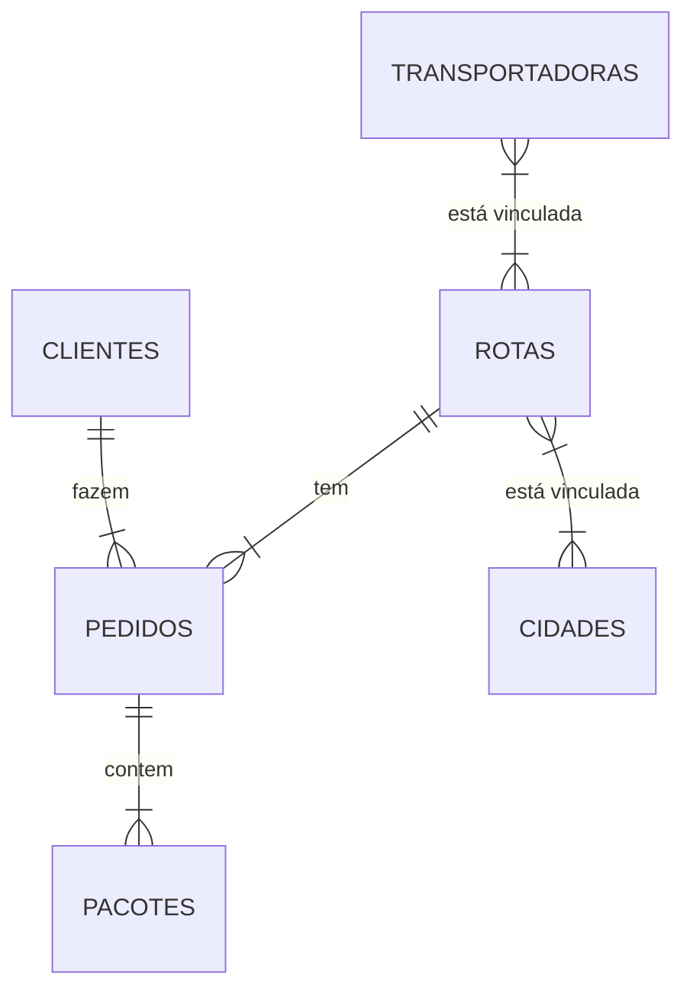

# Entrega-Mais-Web-Rails

> Repositório contendo Backend em Ruby on Rails

## Pré-Defesa dos Projetos

---

- Apresentação da Equipe (máximo 2 integrantes)
	- Diego Figueiredo de Medeiros
	- Alissia Deolinda Oliveira de Lima
- Uma breve descrição do sistema
	- Escopo do problema
		> Há um sério problema com a organização e padronização das entregas de pacotes, principalmente no escopo das grandes feiras (como as de Santa Cruz, Caruaru), tanto em polos urbanos quanto grandes capitais. Logo, há a necessidade de uma solução que consiga organizar, informar e facilitar o processo de entregas.
	- Objetivo 
		> Desenvolver uma aplicação mobile escalável  a fim de servir como mediador entre as entregas, previamente informais, feitas através de excursões, facilitando o processo de entregas como um todo, com a opção de organizar e informar todo o andamento das mercadorias, para que, através da criação, edição, exclusão e acompanhamento de pedidos, rotas, clientes, despachantes, pacotes, veículos e transportadoras, haja uma mitigação no grave problema com a organização e padronização das entregas de pacotes, principalmente no escopo das grandes feiras.
- Requisitos funcionais
	> O sistema deverá permitir, de maneira rápida e eficiente, o gerenciamento de entregas através de cadastros e relatórios. Deverá auxiliar a organização informações do pacote, transportadora, rotas, clientes, veiculos e pedido durante excursões em grandes feiras, permitindo que os transportadores e fornecedores possam administrar e fazer análises e estudos em cima destes dados coletados, além de poder gerar uma série de relatórios, pacotes, pedidos, clientes, rotas históricos) e gráficos (valores de frete, compra e pedidos).

- Requisitos não funcionais:
	- React / React Native
	- Ruby on Rails
	- Cloud
		- AWS
	- Fila de Mensagens
		- RabbitMQ
	- Cache
		- REDIS
	- REST
	- RPC/RMI

- O modelo relacional do BD

	## Diagrama ER
	---
	
<!-- 
	- Entities and Relationships
		> Mermaid syntax for ER diagrams is compatible with PlantUML, with an extension to label the relationship. Each statement consists of the following parts:
	`<first-entity> [<relationship> <second-entity> : <relationship-label>]`

	- **first-entity** is the name of an entity. Names must begin with an alphabetic character and may also contain digits, hyphens, and underscores.
	- **relationship** describes the way that both entities inter-relate. See below.
	- **second-entity** is the name of the other entity.
	- **relationship-label** describes the relationship from the perspective of the first entity.  -->

	

---

## Pré-requisitos
---

É necessário a instalação dos seguintes recursos:

- [Docker](https://docs.docker.com/get-docker/) e [WSL 2](https://docs.microsoft.com/en-us/windows/wsl/install)

## Iniciando via Docker
Na raiz do projeto, onde há o arquivo `docker-compose.yml`, execute o seguinte comando:
```
docker compose build
```

Em seguida, suba o container com o seguinte comando:
```
docker compose up -d
```

Crie a database com o seguinte comando:
```
docker compose exec web rake db:create
```

Crie as tabelas na database com o seguinte comando:
```
docker compose exec web rails db:migrate
```
<!--
- Será criado volumes gerenciados pelo próprio **Docker** na sua maquina local, a fim de persistir os dados
- **RabbitMQ** será iniciado na porta **`5672`**
	- **Management Console** será iniciado na porta **`15672`**
	- user: **`ifpb`**
	- password: **`ifpb`**
- **Postgres** serão iniciados na porta **`5432`**
	- **pgAdmin** será iniciado na porta **`5050`**
	- user: **`ifpb`**
	- password: **`ifpb`** -->


## Usando
--- 
Agora basta enviar requisições com o método **`POST`** para a porta **`3000`**:
```
http://localhost:3000/<model>
```
Com o corpo da requisição contendo um JSON neste formato:
```
{
	<atributo1>: <dado1>,
	<atributo2>: <dado2>,
	...
}
```

[⬆ Voltar ao topo](#Entrega-Mais-Web-Rails)


<!-- # README

This README would normally document whatever steps are necessary to get the
application up and running.

Things you may want to cover:

* Ruby version

* System dependencies

* Configuration

* Database creation

* Database initialization

* How to run the test suite

* Services (job queues, cache servers, search engines, etc.)

* Deployment instructions

* ... -->
