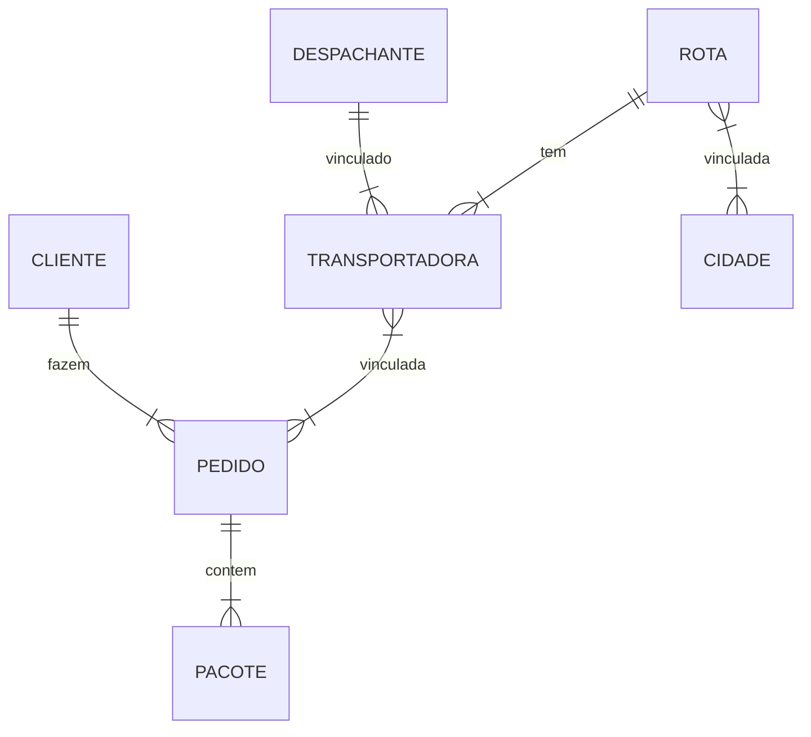
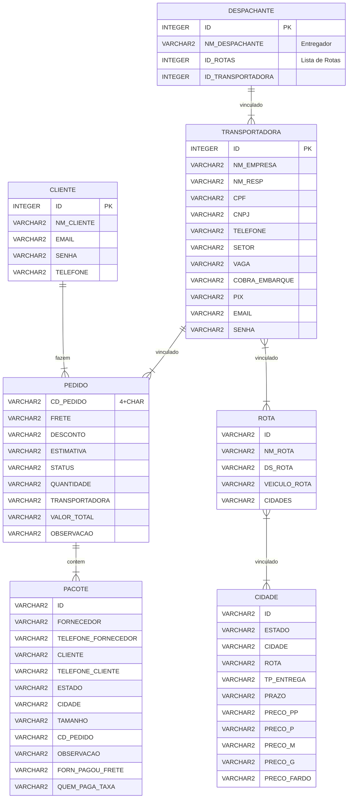

# Entrega-Mais-Web-Rails

> Repositório contendo Backend em Ruby on Rails

## Pré-Defesa dos Projetos

---

- Apresentação da Equipe (máximo 2 integrantes)
	- Diego Figueiredo de Medeiros
	- Alissia Deolinda Oliveira de Lima
- Uma breve descrição do sistema
	- Escopo do problema
		> Há um sério problema com a organização e padronização das entregas de pacotes, principalmente no escopo das grandes feiras (como as de Santa Cruz, Caruaru), tanto em polos urbanos quanto grandes capitais. Logo, há a necessidade de uma solução que consiga organizar, informar e facilitar o processo de entregas.
	- Objetivo 
		> Desenvolver uma aplicação mobile escalável  a fim de servir como mediador entre as entregas, previamente informais, feitas através de excursões, facilitando o processo de entregas como um todo, com a opção de organizar e informar todo o andamento das mercadorias, para que, através da criação, edição, exclusão e acompanhamento de pedidos, rotas, clientes, despachantes, pacotes, veículos e transportadoras, haja uma mitigação no grave problema com a organização e padronização das entregas de pacotes, principalmente no escopo das grandes feiras.
- Requisitos funcionais
	> O sistema deverá permitir, de maneira rápida e eficiente, o gerenciamento de entregas através de cadastros e relatórios. Deverá auxiliar a organização informações do pacote, transportadora, rotas, clientes, veiculos e pedido durante excursões em grandes feiras, permitindo que os transportadores e fornecedores possam administrar e fazer análises e estudos em cima destes dados coletados, além de poder gerar uma série de relatórios, pacotes, pedidos, clientes, rotas históricos) e gráficos (valores de frete, compra e pedidos).

- Requisitos não funcionais:
	- React / React Native
	- Ruby on Rails
	- Cloud
		- AWS
	- Fila de Mensagens
		- RabbitMQ
	- Cache
		- REDIS
	- REST
	- RPC/RMI

- O modelo relacional do BD


---
# Diagramas ER
## Conceitual
---

## Lógico
---

<style>
	/* 
	fill		| Background color of an entity or attribute
	stroke		| Border color of an entity or attribute, line color of a relationship 
	!importante	| Needed to change default attributes
	*/
/* Box */
.er.attributeBoxEven { /*The box containing attributes on even-numbered rows*/
	fill: #525252 !important; 
}
.er.attributeBoxOdd { /*The box containing attributes on odd-numbered rows*/
	fill: #383838 !important;
}

/* Entity */
.er.entityBox { /*The box representing an entity*/
	stroke-width: 2px !important;
}
.er.entityLabel { /*The label for an entity*/
}

/* Relationship */
.er.relationshipLabel { /*The label for a relationship*/
}
.er.relationshipLabelBox { /*The box surrounding a relationship label*/
}
.er.relationshipLine { /*The line representing a relationship between entities*/
}
</style>




## Pré-requisitos
---

É necessário a instalação dos seguintes recursos:

- [Docker](https://docs.docker.com/get-docker/) e [WSL 2](https://docs.microsoft.com/en-us/windows/wsl/install)

## Iniciando via Docker
Na raiz do projeto, onde há o arquivo `docker-compose.yml`, execute o seguinte comando:
```
docker compose build
```

Em seguida, suba o container com o seguinte comando:
```
docker compose up -d
```

Crie a database com o seguinte comando:
```
docker compose exec web rake db:create
```

Crie as tabelas na database com o seguinte comando:
```
docker compose exec web rails db:migrate
```

## Usando
--- 
Agora basta enviar requisições com o método **`POST`** para a porta **`3000`**:
```
http://localhost:3000/<model>
```
Com o corpo da requisição contendo um JSON neste formato:
```
{
	<atributo1>: <dado1>,
	<atributo2>: <dado2>,
	...
}
```

[⬆ Voltar ao topo](#Entrega-Mais-Web-Rails)


<!-- # README

This README would normally document whatever steps are necessary to get the
application up and running.

Things you may want to cover:

* Ruby version

* System dependencies

* Configuration

* Database creation

* Database initialization

* How to run the test suite

* Services (job queues, cache servers, search engines, etc.)

* Deployment instructions

* ... -->
